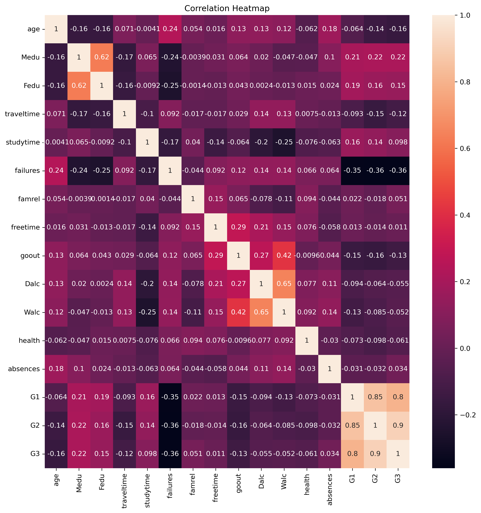

**Student Final Grade Prediction**

This project predicts students' final grade (`G3`) using demographic, behavioral, and academic features.

**Project Overview**

This project predicts students' final grades 'G3' using demographic,
behavioral, and academic data.

Two regression approaches were compared:

- Early-Year Prediction Model
- Mid-Year Prediction Model

The objective is to analyze how prediction accuracy improves when mid-year grades are included.

**Models Used**

 Baseline Model

 Linear Regression

 Random Forest Regressor

**Results**

| Model | MAE | RMSE | R² Score |
|------|------|------|------|
| Early-Year Baseline | 3.65 | 4.55 | -0.01 |
| Early-Year Linear Regression | 3.39 | 4.19 | 0.14 |
| Early-Year Random Forest | 3.00 | 3.77 | 0.31 |
| Mid-Year Baseline | 3.65 | 4.55 | -0.01 |
| Mid-Year Linear Regression | 1.65 | 2.38 | 0.72 |
| Mid-Year Random Forest | 1.21 | 2.01 | 0.80 |

The best early-year model was Random Forest with an R2 score of 0.31 and MAE of 3.00.

The best mid-year model was Random Forest with an R2 score of 0.80 and MAE of 1.21.

**Key Insights**

- Mid-year models performed significantly better than early-year models.
- Random Forest achieved the best performance overall with an R² score of 0.80.
- Including previous grades (G1 and G2) greatly improved prediction accuracy.
- Baseline models showed very poor predictive performance compared to machine learning models.

**Conclusion**

Early-year demographic and behavioral features provide limited predictive power. Prediction becomes much more reliable when previous grades `G1` and `G2` are included.

**Dataset Information**

Dataset Source:
UCI Student Performance Dataset

Target Variable:
- G3 (final grade)

Features:
- study time
- absences
- family support
- previous grades and so on

**Visualization**

